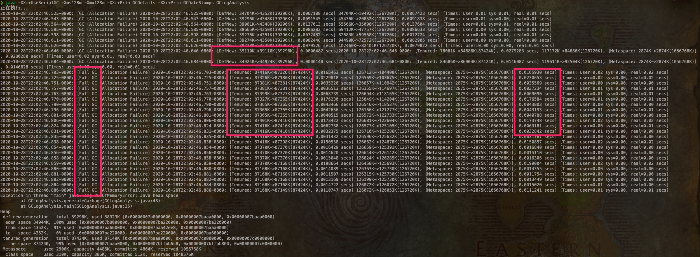
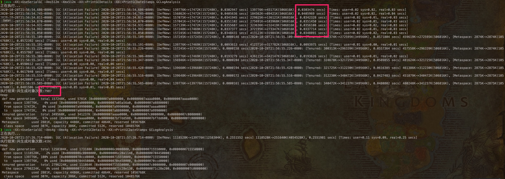
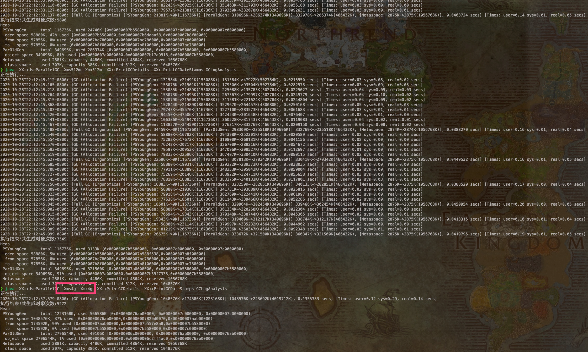
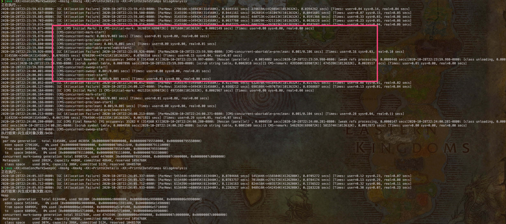
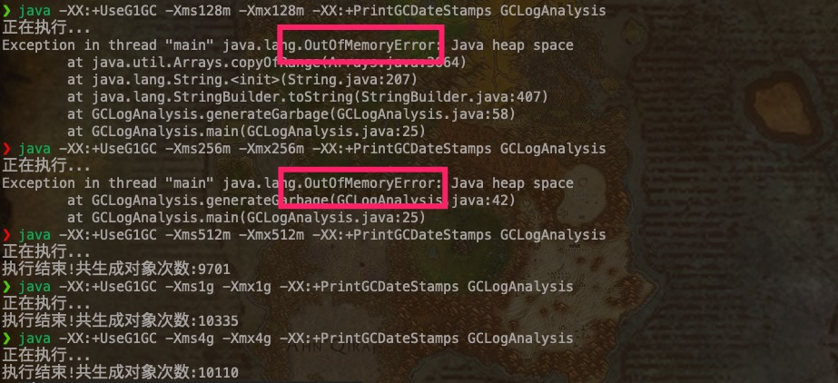

# GC test

## 相同GC下，不同Xmx参数


1. 经过多次尝试验证，发现普遍第一次执行生成的对象较少，短时间内后面的执行生成对象会多且相差不太大，过一段时间再次执行又会是开始的一次较少，难道需要预热 ???
2. 随着多轮 young gc 进行，young 空间和整个堆空间都在逐渐增大（增大值貌似是 young 增大的空间大小），导致 gc 时间逐渐增加。
3. 观察到 fullgc 的耗时 不一定大于 young gc（虽然理论上应该大于）。
4. 不指定 gc 不指定 Xmx 参数情况下，初始堆内存大小 Xms 为 256M，最大堆内存 Xmx 为 4 G，当前机器内存 16 G，gc 为并行 gc。（以下为指定日志输出到文件中时查看的内容）

```
Memory: 4k page, physical 16777216k(2721860k free)

/proc/meminfo:

CommandLine flags: -XX:InitialHeapSize=268435456 -XX:MaxHeapSize=4294967296 -XX:+PrintGC -XX:+PrintGCDateStamps -XX:+PrintGCDetails -XX:+PrintGCTimeStamps -XX:+UseCompressedClassPointers -XX:+UseCompressedOops -XX:+UseParallelGC
```

5. 后面分别尝试了使用 -Xmx128m -Xmx256m -Xmx1g -Xmx2g -Xmx4g等参数，可以发现当 -Xmx 过小时，程序 fullgc 数明显增加，甚至忙于 fullgc 导致没有资源执行业务，最终导致oom。当逐渐增加 -Xmx 参数时，fullgc 次数减小，生成对象数目也变多（程序业务性能提升）。


## 不同GC下，不同Xmx参数

### SerialGC





1. 串行 gc 使用 -Xms128m -Xmx128m 时，开始还能快速进行 young gc，后面直接全称 fullgc 一直到 oom，因为实际回收的内存不大，所以耗时较低。
2. 串行 gc 提升 Xms -Xmx 后甚至不会发生 fullgc，可以看到回收到内存幅度较大，耗时较高，生成的对象变多。4g内存时甚至只发生了一次 young gc。

### ParallelGC



并行 gc 行为差不太多，不同的是这里 将 -Xms4g -Xmx4g 设置为一样时，没有发生 fullgc，而开始测试时没有设置 -Xms 时发生了大量 fullgc。

### CMS GC



CMS GC 使用 -Xms4g -Xmx4g 时没有发生 fullgc，1g时可以看到并发阶段。

### G1 GC



G1 GC 详细日志流程相对复杂。针对大内存时性能较好，小内存时直接发生了 oom。

## GC 在高并发下的实际效果

: (

```
Unable to locate an executable at "/Library/Java/JavaVirtualMachines/adoptopenjdk-8.jdk/Contents/Home/bin/jvisualvm" (-1)

Unable to locate an executable at "/Library/Java/JavaVirtualMachines/adoptopenjdk-8.jdk/Contents/Home/bin/jmc" (-1)
```

fix: https://stackoverflow.com/questions/10873437/unable-to-locate-an-executable-at-usr-bin-java-bin-java-1


ParallelGC: 吞吐高，但是每次 gc 延迟可能较高。

CMS GC: 吞吐低，但每次 gc 延迟较低。

G1 GC:  每次 gc 延迟可控，适宜大内存情况。

finally 内存不能太小，内存高也是对系统的一个保护（不容器轻易被冲垮）。


to be continued ：）