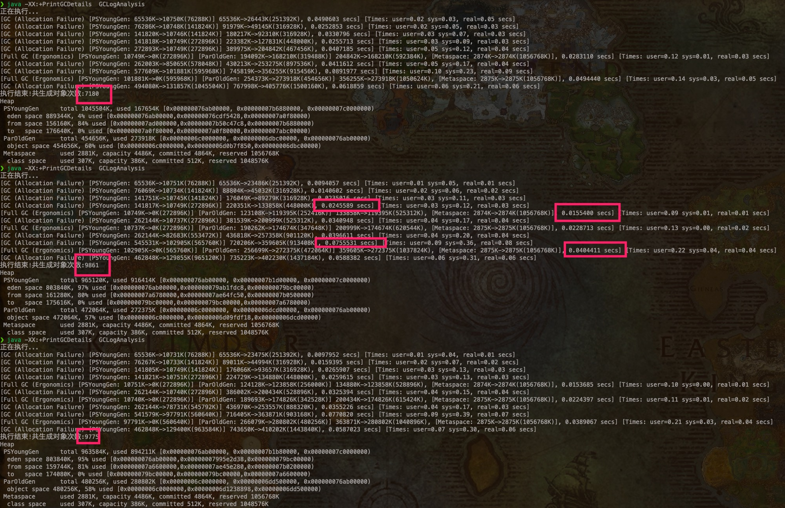

# GC test

## 相同GC下，不同Xmx参数



1. 经过多次尝试验证，发现普遍第一次执行生成的对象较少，短时间内后面的执行生成对象会多且相差不太大，过一段时间再次执行又会是开始的一次较少，难道需要预热 ???
2. 随着多轮 young gc 进行，young 空间和整个堆空间都在逐渐增大（增大值貌似是 young 增大的空间大小），导致 gc 时间逐渐增加。
3. 观察到 fullgc 的耗时 不一定大于 young gc（虽然理论上应该大于）。
4. 不指定 gc 不指定 Xmx 参数情况下，初始堆内存大小 Xms 为 256M，最大堆内存 Xmx 为 4 G，当前机器内存 16 G，gc 为并行 gc。（以下为指定日志输出到文件中时查看的内容）

```
Memory: 4k page, physical 16777216k(2721860k free)

/proc/meminfo:

CommandLine flags: -XX:InitialHeapSize=268435456 -XX:MaxHeapSize=4294967296 -XX:+PrintGC -XX:+PrintGCDateStamps -XX:+PrintGCDetails -XX:+PrintGCTimeStamps -XX:+UseCompressedClassPointers -XX:+UseCompressedOops -XX:+UseParallelGC
```

5. 后面分别尝试了使用 -Xmx128m -Xmx256m -Xmx1g -Xmx2g -Xmx4g等参数，可以发现当 -Xmx 过小时，程序 fullgc 数明显增加，甚至忙于 fullgc 导致没有资源执行业务，最终导致oom。当逐渐增加 -Xmx 参数时，fullgc 次数减小，生成对象数目也变多（程序业务性能提升）。


## 不同GC下，相同Xmx参数

to be continued...